# README

# Dokument opisuje kolejne kroki w budowie aplikacji z repozytorium

**1. Punt ten opisuje działania w ramach brancha "Start-stan-aktualny"**

**1.1. Utworzenie aplikacji**

**wersja a) - w terminalu**
    
    rails new Nazwa_aplikacji --css tailwind

**wersja b) - w edytorze RubyMine**

File -> New Project   
w polu "Extra options" wpisać: --css tailwind

    
**1.2. Budowa pierwszego rusztowania dla klasy _Group_**

Tools -> Run Rails Generator : rails generate scaffold Group nazwa:string

Tools -> Rake Tasks : db:migrate

- można w tym momencie uruchomić serwer i sprawdzić działanie aplikacji, w przeglądarce 127.0.0.1:3000/groups 

**1.3. Druga klasa _Students_**

Tools -> Run Rails Generator : rails generate scaffold Student imie:string nazwisko:string album:string group:references

_ostatnia klauzula tworzy powiązanie z klasą Group (klucz obcy)_

- nalezy wykonać migrację do bazy danych
- nalezy dodać relację do klasy _Group_ w pliku modelu, w klasie _Student_ wpis utworzył generator scaffold
 

**1.3. Klasa _Fields_**

Tools -> Run Rails Generator : rails generate scaffold Field nazwa:string 

- w następnym kroku dodajemy powiązanie z klasą Group

Tools -> Run Rails Generator : rails generate migration AddFieldToGroups field:references

- w kolejnym kroku (oczywiście po migracji) należy wykonać edycję modeli _Field_ i _Group_

- obługa relacji:
    - zmiany w kontrolerze _Students_ - do metody student_params dodajemy :field_id

    
- kolejne zmiany dotyczą widoków dla klasy _Student_:
  - widok _form.html.erb - dodajemy pole wyboru dla pola field_id

      
_na obrazku nie jest widoczny opis klasy css ale nie ma to znaczenia dla działania aplikacji_
- zmiany w widoku _student.html.erb - dodajemy wyświetlanie nazwy grupy do której należy student

  
**To koniec działań w ramach gałęzi repozytorium Start-stan-aktualny**     

**2. Add-Course**

**2.1. Utworzenie klasy _Course_**
    
    Tools -> Run Rails Generator : rails generate scaffold Course nazwa:string ects:integer

- wykonujemy migrację do bazy danych

**2.2. Powiązanie klasy _Course_ z klasą _Group_**
    - wygenerowanie migracji tworzącej tabelę łączącą grupy z kursami (wiele do wielu)

    Tools -> Run Rails Generator : rails generate migration CreateJoinTableCoursesGroups course:references group:references

- wykonujemy migrację do bazy danych
 
**2.2. Edycja modeli**
- edytujemy modele _Course_ i _Group_ aby dodać relacje wiele do wielu

- edytujemy kontroler _Groups_ aby umożliwić przypisanie kursów do grupy

- edytujemy widoki dla klasy _Group_ aby umożliwić przypisanie kursów do grupy
  - widok _form.html.erb_

  - widok _group.html.erb_

**To kończy operacje w gałęzi Add-Course**

**3. Add-Grade**

**3.1. Utworzenie tabeli pośredniej pomiędzy _Course_ a _Student_**
W tym przypadku wykorzystujemy tabelę łączącą Course i Student (podobnie jak w przypadku _Group_ i _Course_) ale musimmy ją zmodyfikować.
W pierwszym kroku tworzymy tabelę pośrednią podobnie jak w poprzednim przypadku.
    
    Tools -> Run Rails Generator : rails generate migration CreateJoinTableCoursesStudenrts course:references student:references

- wykonujemy migrację do bazy danych
- następnie tworzymy migrację dodającą kolumnę _grade_ do tabeli łączącej i zmieniamy nazwę tabeli na Grades

    Tools -> Run Rails Generator : rails generate migration AddGradeToCourseStudent grade:integer
- w pliku migracji zmieniamy nazwę tabeli na _grades_ i dodajemy klucz główny kompozytowy

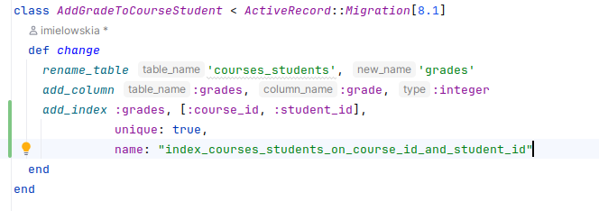

- wykonujemy migrację do bazy danych

**3.2. Edycja modeli**
- tworzymy plik modelu _Grade_ (grade.rb)

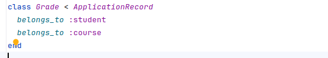

- edytujemy modele _Course_ i _Student_ aby dodać relacje wiele do wielu przez tabelę _Grades_

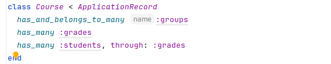

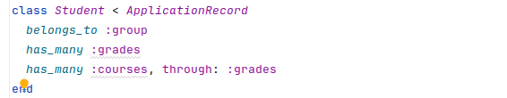

 **3.3. Edycja kontrolera _Courses_**
 
Koncepcja obsługi ocen polega na tym, że oceny będą dopisywane w widoku kursów, dla każdego kursu będą wypisane grupy i dodany przycisk do wywołania widoku z ocenami tej grupy, następnie w tym widoku będą widoczni studenci wraz z ich ocenami oraz przycisk do edycji ocen, który skieruje do formularza pozwalającego na edycję, po naciśnięciu przycisku "Zapisz" użytkownik zostanie przekierowany do widoku listy ocen danej grupy.
W związku z tym potrzebne będą następujące metody w kontrolerze _Courses_:
- metoda _grade_ - wyświetla widok z ocenami dla danej grupy

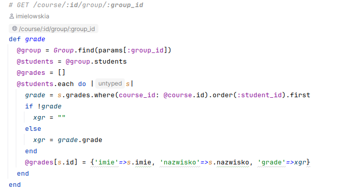

- metoda _grade_set_ - wyświetla formularz do edycji ocen dla danej grupy

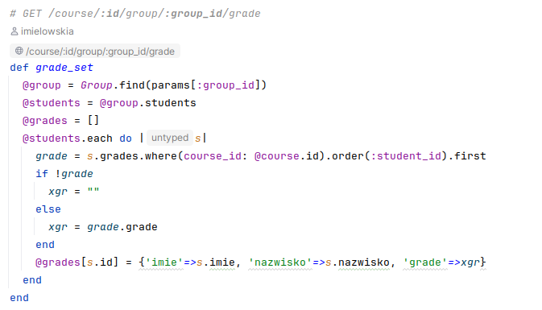

- metoda _grade_save_ - zapisuje oceny do bazy

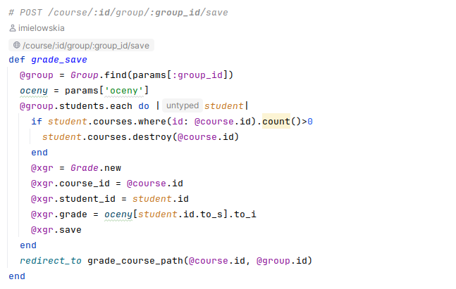

- wszystkie te nowe metody muszą być dodane do listy metod dla których wykonana jest metoda _before_action :set_course_

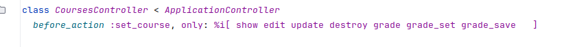

**3.4. Dodanie tras do pliku _config/routes.rb_**

- dodajemy trzy nowe trasy do obsługi ocen

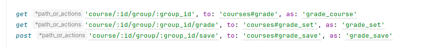

**3.5. Edycja widoków dla klasy _Course_**

- edycja widoku __course.html.erb_ - dodanie przycisku do widoku ocen dla danej grupy
- utworzenie widoku _grade.html.erb_ - wyświetlanie ocen dla danej grupy
- utworzenie widoku _grade_set.html.erb_ - formularz do edycji ocen dla danej grupy

Pliki są widoków dostepne w repozytorium.

**4. Add-GradeDetails**

W tym kroku dodamy obsługę ocen cząstkowych. Sytuacja jest podobna do kroku poprzedniego ale chcemy mieć mozliwość zapisywania wielu ocen dla jednego studenta w ramach przedmiotu.

**4.1. Utworzenie klasy _GradeDetail_**

Tym razem wygenerujemy model dla klasy _GradeDetail_ która będzie przechowywać oceny cząstkowe.

    Tools -> Run Rails Generator : rails generate model GradeDetail course:references student:references grade:decimal{3,2} 

- wykonujemy migrację do bazy danych

4.2. Edycja modeli
- edytujemy modele _Course_, _Student_ oraz _GradeDetail_

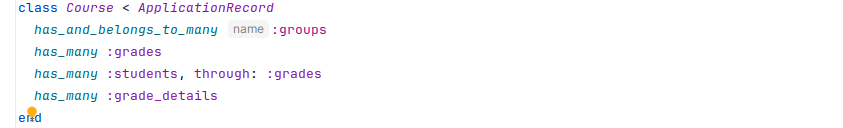

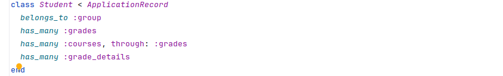

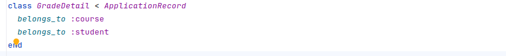

**4.3. Edycja kontrolera _Courses_**
- edytujemy kontroler _Courses_ aby dodać obsługę ocen cząstkowych metody:
  - metoda _grade_details_ - wyświetla widok z ocenami cząstkowymi
  - metoda _grade_details_set_ - wyświetla formularz do edycji ocen cząstkowych
  - metoda _grade_details_save_ - zapisuje oceny cząstkowe do bazy
  - metody te muszą być dodane do listy metod dla których wykonana jest metoda _before_action :set_course_

**4.4. Dodanie tras do pliku _config/routes.rb_**
- dodajemy trzy nowe trasy do obsługi ocen cząstkowych

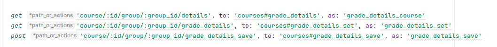

**4.5. Edycja widoków dla klasy _Course_**
- edycja widoku __course.html.erb_ - dodanie przycisku do widoku ocen cząstkowych dla danej grupy
- utworzenie widoku _grade_details.html.erb_ - wyświetlanie ocen cząstkowych dla danej grupy
- utworzenie widoku _grade_details_set.html.erb_ - formularz do edycji ocen cząstkowych dla danej grupy

Wszystkie pliki do sprawdzenia w repozytorium.

**5. Add-walidacje-itp**

**5.1 Walidacje**
Walidacje wartości wprowadzanych do bazy danych dodajemy w plikach modeli.

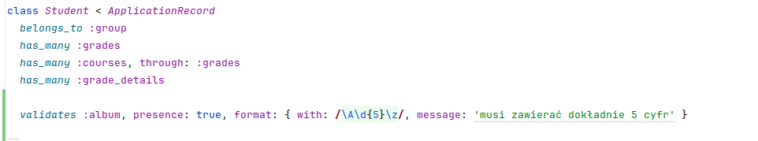

Powyżej przykład walidacji atrybutu _'album'_ - musi zawierać dokładnie 5 cyfr

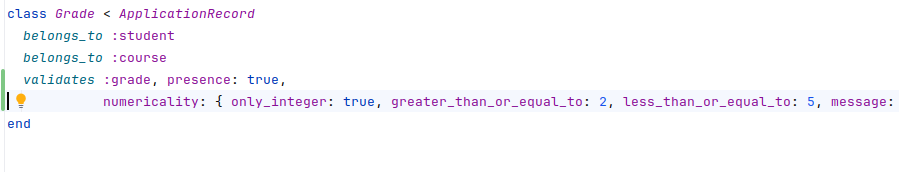
A teraz walidacja atrybutu _'grade'_ - ocena musi się zawierać pomiędzy 2 a 5

**5.2. Dodanie przetwarzania wartości atrybutu przed zapisem do bazy**

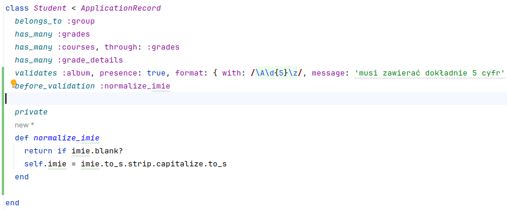
Powyżej przykład przetwarzania atrybutu _'imie'_ - przed zapisaniem do bazy imię jest zamieniane na format z wielką literą na początku a pozostałe litery małe

**5.3. Dodanie górnej belki z linkami to widoków w całej aplikacji**

Do tego celu wykorzystamy plik _app/views/layouts/application.html.erb_ w którym są zapisane informacje o szablonie strony dla wszystkich widoków w aplikacji.
Wygodnie jest wydzielić ten fragment kodu do osobnego pliku i wczytać go w szablonie.
Tworzymy plik 'app/views/layouts/_header.html.erb' i umieszczamy w nim kod paska nawigacyjnego a następnie dodajemy renderowanie w pliku '_application.html.erb_'

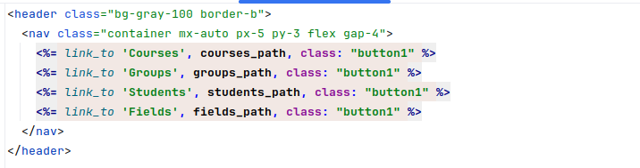

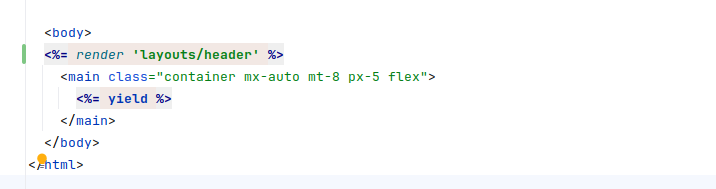

**5.4. I na koniec dodamy stronę startową aplikacji** 

W pliku _config/routes.rb_ dodajemy trasę do strony startowej
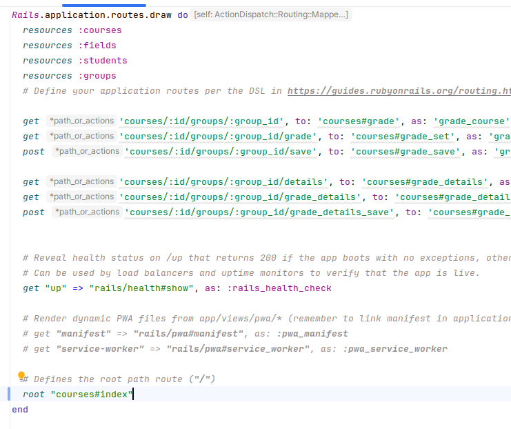

**I to na tyle w tym branchu**