# README

# Dokument opisuje kolejne kroki w budowie aplikacji z repozytorium

**1. Punt ten opisuje działania w ramach brancha "Start-stan-aktualny"**

**1.1. Utworzenie aplikacji**

**wersja a) - w terminalu**
    
    rails new Nazwa_aplikacji --css tailwind

**wersja b) - w edytorze RubyMine**

File -> New Project   
w polu "Extra options" wpisać: --css tailwind

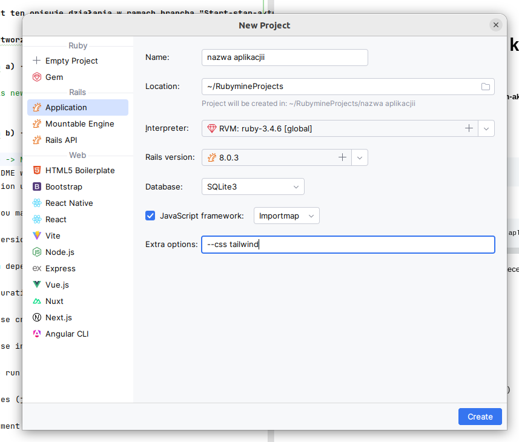

    
**1.2. Budowa pierwszego rusztowania dla klasy _Group_**

Tools -> Run Rails Generator : rails generate scaffold Group nazwa:string

Tools -> Rake Tasks : db:migrate

- można w tym momencie uruchomić serwer i sprawdzić działanie aplikacji, w przeglądarce 127.0.0.1:3000/groups 

**1.3. Druga klasa _Students_**

Tools -> Run Rails Generator : rails generate scaffold Student imie:string nazwisko:string album:string group:references

_ostatnia klauzula tworzy powiązanie z klasą Group (klucz obcy)_

- nalezy wykonać migrację do bazy danych
- nalezy dodać relację do klasy _Group_ w pliku modelu, w klasie _Student_ wpis utworzył generator scaffold
 
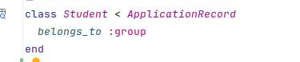

**1.3. Klasa _Fields_**

Tools -> Run Rails Generator : rails generate scaffold Field nazwa:string 

- w następnym kroku dodajemy powiązanie z klasą Group

Tools -> Run Rails Generator : rails generate migration AddFieldToGroups field:references

- w kolejnym kroku (oczywiście po migracji) należy wykonać edycję modeli _Field_ i _Group_

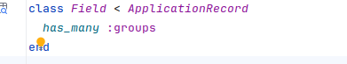

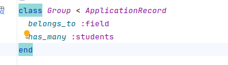
- obługa relacji:
    - zmiany w kontrolerze _Students_ - do metody student_params dodajemy :field_id

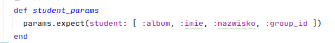
    
- kolejne zmiany dotyczą widoków dla klasy _Student_:
  - widok _form.html.erb - dodajemy pole wyboru dla pola field_id

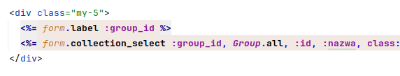
      
_na obrazku nie jest widoczny opis klasy css ale nie ma to znaczenia dla działania aplikacji_
- zmiany w widoku _student.html.erb - dodajemy wyświetlanie nazwy grupy do której należy student

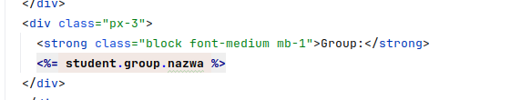
  
**To koniec działań w ramach gałęzi repozytorium Start-stan-aktualny**     

**2. Add-Course**

**2.1. Utworzenie klasy _Course_**
    
    Tools -> Run Rails Generator : rails generate scaffold Course nazwa:string ects:integer

- wykonujemy migrację do bazy danych

**2.2. Powiązanie klasy _Course_ z klasą _Group_**
    - wygenerowanie migracji tworzącej tabelę łączącą grupy z kursami (wiele do wielu)

    Tools -> Run Rails Generator : rails generate migration CreateJoinTableCoursesGroups course:references group:references

- wykonujemy migrację do bazy danych
 
**2.2. Edycja modeli**
- edytujemy modele _Course_ i _Group_ aby dodać relacje wiele do wielu

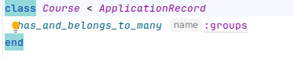

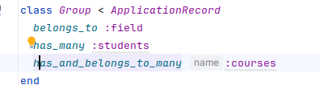

- edytujemy kontroler _Groups_ aby umożliwić przypisanie kursów do grupy

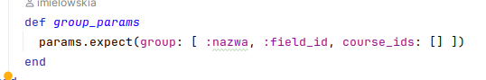
- edytujemy widoki dla klasy _Group_ aby umożliwić przypisanie kursów do grupy
  - widok _form.html.erb_

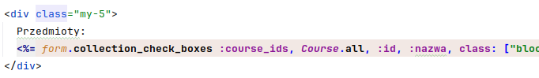
  - widok _group.html.erb_

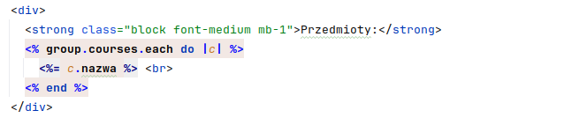

**To kończy operacje w gałęzi Add-Course**